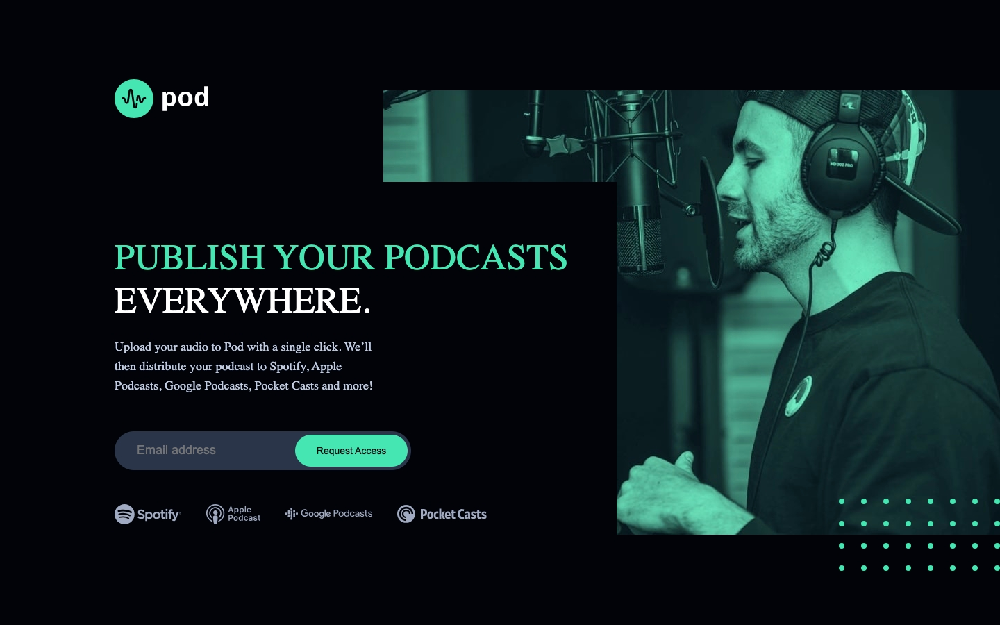

# Frontend Mentor - Pod request access landing page solution

This is a solution to the [Pod request access landing page challenge on Frontend Mentor](https://www.frontendmentor.io/challenges/pod-request-access-landing-page-eyTmdkLSG). Frontend Mentor challenges help you improve your coding skills by building realistic projects.

## Table of contents

- [Overview](#overview)
  - [Screenshot](#screenshot)
  - [Links](#links)
  - [Built with](#built-with)
  - [What I learned](#what-i-learned)
  - [Continued development](#continued-development)
  - [Useful resources](#useful-resources)
- [Author](#author)

## Overview

An HTML CSS and Javascript interactive rating component.

### Screenshot

### Links

- Solution URL: https://www.frontendmentor.io/solutions/responsive-landing-page-using-html-and-sass-LSF__YoPKW
- Live Site URL: https://pod-mq9z.vercel.app/
- GitHub Repo: https://github.com/ZounMedia/pod

## My process

### Built with

- Semantic HTML5 markup
- SCSS
- Flexbox
- Mobile-first workflow

### What I learned

I learned advanced CSS position using relative and absolute positioning for UI elements.

### Continued development

Using SASS really made it really easy to organize and maintain my styles.

### Useful resources

- https://fonts.google.com/specimen/Chivo - Google Fonts Chivo url
- https://sass-lang.com/documentation/ - SASS documentation
- HTML DOM element event listeners - https://www.w3schools.com/jsref/met_element_addeventlistener.asp

## Author

- Frontend Mentor - https://www.frontendmentor.io/profile/@rzounlom
